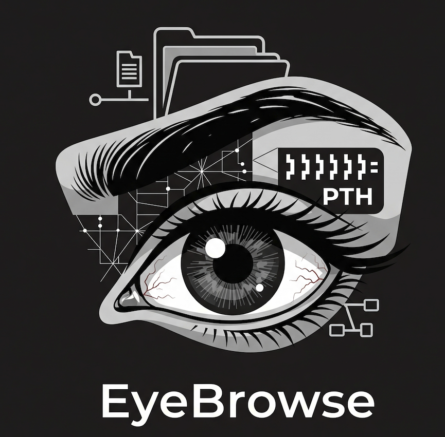
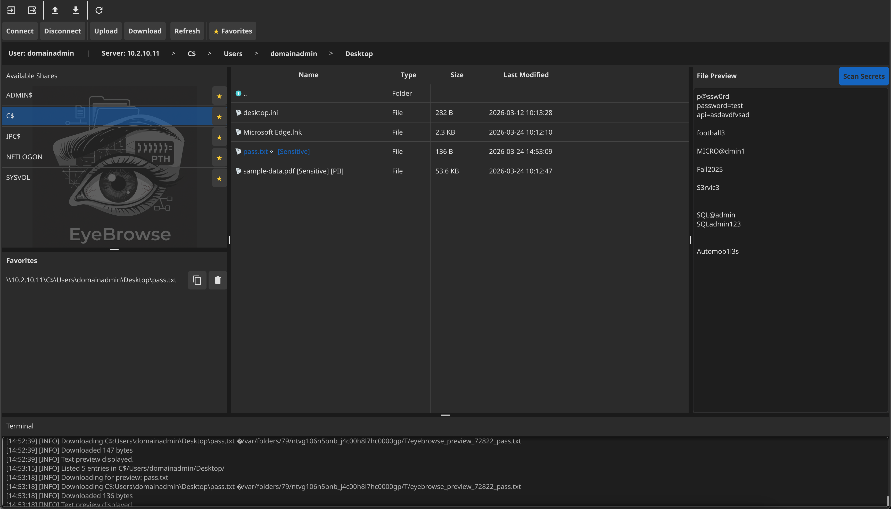

<p align="center">
  
</p>
<p align="center">
  
</p>

<h1 align="center">EyeBrowse</h1>

<p align="center">
  <strong>SMB File Explorer with Pass-the-Hash Authentication</strong><br>
  Browse, download, upload, preview, and scan files on SMB shares using NTLM hashes.
</p>

---

## Quick Start

### macOS

```bash
xcode-select --install          # one-time: install Xcode CLI tools
git clone https://github.com/YOUR_USERNAME/EyeBrowse.git
cd EyeBrowse
go build -o eyebrowse .
./eyebrowse
```

To build a native `.app` bundle with dock icon:

```bash
make build
open EyeBrowse.app
```

### Linux (Kali / Debian / Ubuntu)

```bash
# Install system dependencies (one-time)
sudo apt update
sudo apt install -y golang gcc libgl1-mesa-dev xorg-dev \
    libxcursor-dev libxrandr-dev libxinerama-dev \
    libxi-dev libxxf86vm-dev

# Clone and build
git clone https://github.com/YOUR_USERNAME/EyeBrowse.git
cd EyeBrowse
go build eyebrowse .
./eyebrowse
```

> If your distro's `golang` package is older than 1.24, install Go manually from https://go.dev/dl/

> On GCC 15 (aarch64), you may see a `.sframe` linker warning — this is cosmetic and the binary still works.

---

## What is EyeBrowse?

EyeBrowse is a GUI tool for penetration testers and red teamers. It connects to SMB/CIFS shares using **NTLM pass-the-hash** authentication — no plaintext passwords needed. Built in Go with the [Fyne](https://fyne.io/) framework, it compiles to a single binary with the logo embedded.

### Key Capabilities

- **Pass-the-Hash** — Authenticate with NTLM hashes (`LM:NT` or `NT` format)
- **SOCKS4/5 Proxy** — Route through SOCKS proxies for pivoting
- **File Browser** — Navigate shares, download/upload files, preview text/images/Office docs (PDF, DOCX, XLSX, PPTX)
- **Secret Scanning** — Scan files or entire folders for sensitive data: passwords, SSNs, credit cards, API keys, SSH keys, NTLM hashes, connection strings, and 30+ other patterns
- **Heuristic Password Detection** — Identifies likely passwords (e.g. `Micr0@dmin1`, `P@ssw0rd`, `Welcome1!`) using structural analysis — no dictionary required
- **Favorites & Tags** — Save paths with encrypted credentials, tag files for reporting, export to clipboard or file
- **Encrypted Credentials** — Saved hashes are AES-256-GCM encrypted at rest

### NTLM Hash Formats

```
aad3b435b51404eeaad3b435b51404ee:31d6cfe0d16ae931b73c59d7e0c089c0   # LM:NT
31d6cfe0d16ae931b73c59d7e0c089c0                                     # NT only
```

---

## Usage

1. **Connect** — Enter domain, username, NTLM hash, and target IP
2. **Browse** — Select a share, double-click folders, use breadcrumbs to navigate
3. **Right-click** any file/folder for: Preview, Download, Upload, Copy UNC Path, Tag, Scan, Add to Favorites
4. **Scan Secrets** — Preview a file then click Scan Secrets, or right-click a folder to scan recursively
5. **Proxy** — Configure SOCKS proxy under Settings if needed

---

## Project Structure

```
main.go              Entry point, embeds logo
explorer.go          UI controller: file table, shares, favorites, tags, preview
smb.go               SMB2/3 client (connect, list, download, upload)
dialogs.go           Auth and proxy dialogs
patterns.go          Sensitive data scanner + heuristic password scoring
patterns_test.go     Password detection test suite
office.go            Text extraction from PDF, DOCX, XLSX, PPTX
crypto.go            AES-256-GCM credential encryption
theme.go             Custom dark theme
native_dialogs.go    macOS native file dialogs (osascript)
Makefile             Build targets (dev, build, run, clean)
```

---

## Disclaimer

For authorized penetration testing and red team engagements only. Obtain proper written authorization before use.

